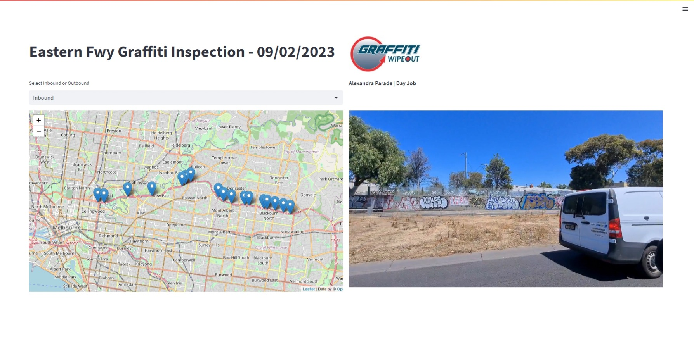

# Eastern Fwy Graffiti Inspection App

This Streamlit application provides an interactive map that displays graffiti inspection data for the Eastern Freeway on 09/02/2023. Users can toggle between inbound and outbound data, click on specific locations on the map, and view associated graffiti inspection videos.

## Live Demo

You can view a live demo of the application at [https://graffiti-map.streamlit.app/](https://graffiti-map.streamlit.app/).




## Features

- **Interactive Map**: Utilizes the Folium library to render an interactive map showing graffiti inspection locations.
- **Inbound/Outbound Toggle**: Users can switch between inbound and outbound data to view different sets of graffiti inspection points.
- **Video Playback**: Upon clicking a specific location on the map, the application displays the associated graffiti inspection video.

## Data Source

The application uses data from a CSV file that contains the following columns:

- `physical_coordinate`: The latitude and longitude of the graffiti location.
- `type`: Specifies the type of media associated with the graffiti location (e.g., video).
- `path`: Path to the media file associated with the graffiti location.
- `loc_name`: Name/description of the graffiti location.
- `is_day_job`: Specifies if the inspection was done during the day.
- `direction`: Direction of the freeway (inbound/outbound).

## Setup and Installation

1. **Clone the Repository**: 

   ```
   git clone https://github.com/I-Davey/streamlit-graffiti-map.git
   ```

2. **Navigate to the Directory**:

   ```
   cd streamlit-graffiti-map
   ```

3. **Install Required Libraries**:

   ```bash
   pip install streamlit folium pandas
   ```

4. **Run the Streamlit App**:

   ```bash
   streamlit run app.py
   ```
